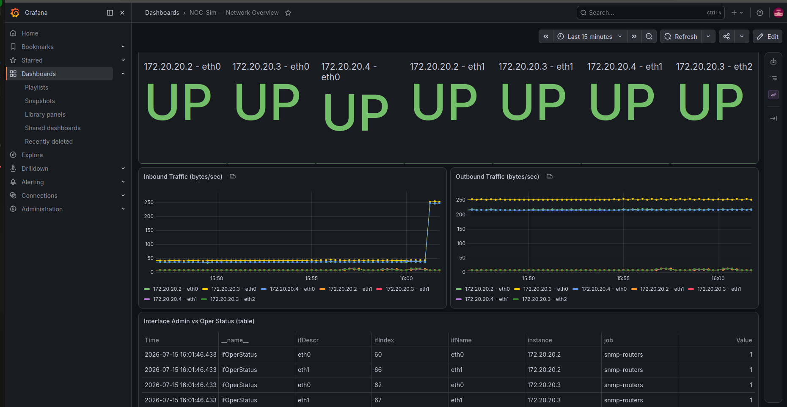

# NOC-Sim

A network home-lab: a simulated 3-router OSPF topology, monitored through a
full SNMP → Prometheus → Grafana stack. Built to practice routing,
troubleshooting, and observability the way they actually show up in NOC/SRE
work.

Work in progress — this is a draft README. A full version (architecture
diagram, from-scratch setup instructions, and a write-up of the problems
hit along the way) is coming.

## How this was built

Built together with Claude (Anthropic) as an AI pair-programming partner.
I set the direction, made the architecture decisions, and ran and verified
every step on my own machine — every container, every test, every
debugging session was real. Claude wrote a large part of the underlying
code and configuration, particularly for the automation (Ansible) and
alerting (Python) pieces, while I drove the process end to end and
diagnosed failures from real output along the way.

## What's in here

- **`topology.clab.yml`** — Containerlab topology: 3 FRR routers (r1-r2-r3)
  in a line, OSPF area 0.
- **`snmp-agent/`** — a sidecar container (Debian + net-snmp) providing SNMP
  for the routers — the FRR image on Alpine had a broken interface module.
- **`prometheus/`** — scrape configuration for SNMP via `snmp_exporter`.
- **`grafana/`** — auto-provisioned datasource and dashboard
  (`network-overview.json`) showing interface status and traffic.
- **`ansible/`** — automation, run in its own container: a config backup
  playbook and a change-management playbook (add + verify a static route),
  talking to the routers over `docker exec` instead of SSH.

## Stack

Containerlab · FRRouting (OSPF) · Docker · net-snmp · snmp_exporter ·
Prometheus · Grafana · Ansible

## Screenshots

## Write-ups

- **[docs/day1-3.md](docs/day1-3.md)** — topology, OSPF, SNMP, Prometheus,
  Grafana: what was built, the problems hit, and the verification output.
- **[docs/day4.md](docs/day4.md)** — Ansible automation over `docker exec`,
  config backups, and a change-management playbook with live verification.
