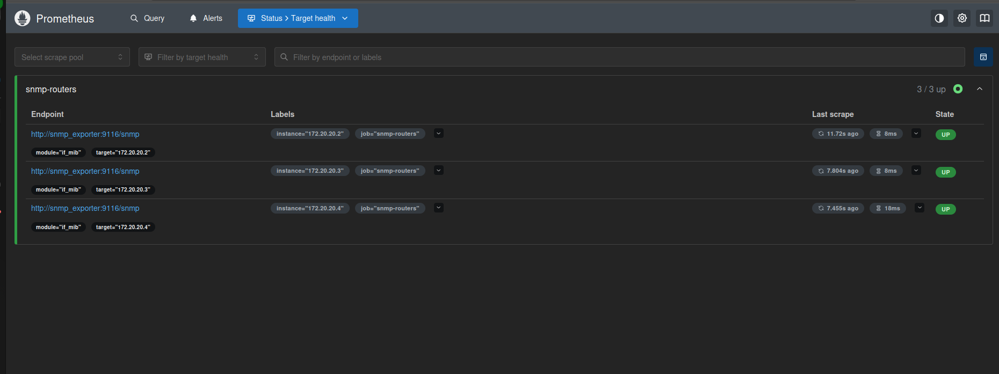

# Days 1-3: Building the network and the monitoring stack

## Day 1 — Topology and OSPF

Three FRR routers (`r1`-`r2`-`r3`) deployed with Containerlab, wired in a
line: `r1—r2—r3`. `r2` sits in the middle with two interfaces; `r1` and `r3`
have no direct link to each other — this was intentional, to prove that OSPF
discovers the route between them on its own.

**Addressing:**
- `r1—r2`: `10.0.12.0/30`
- `r2—r3`: `10.0.23.0/30`
- Loopbacks (stable router IDs): `1.1.1.1`, `2.2.2.2`, `3.3.3.3`

After enabling `ospfd` (disabled by default in the FRR image) and configuring
OSPF area 0 on each router, adjacency came up automatically:

```
$ docker exec clab-noc-sim-r1 vtysh -c "show ip ospf neighbor"

Neighbor ID     Pri State           Up Time         Dead Time Address         Interface
2.2.2.2           1 Full/DR         24.880s           35.117s 10.0.12.2       eth1:10.0.12.1
```

`r1` learned the route to `r3`'s loopback purely from OSPF — no static route
was ever configured:

```
$ docker exec clab-noc-sim-r1 vtysh -c "show ip route ospf"

O   1.1.1.1/32 [110/0] is directly connected, lo
O>* 2.2.2.2/32 [110/10] via 10.0.12.2, eth1
O>* 3.3.3.3/32 [110/20] via 10.0.12.2, eth1
O>* 10.0.23.0/30 [110/20] via 10.0.12.2, eth1
```

End-to-end verification, loopback to loopback across the full path:

```
$ docker exec clab-noc-sim-r1 ping -c 4 -I 1.1.1.1 3.3.3.3

4 packets transmitted, 4 packets received, 0% packet loss
round-trip min/avg/max = 0.074/0.128/0.165 ms
```

**A real problem hit along the way:** editing `/etc/frr/daemons` inside a
running container doesn't take effect — `watchfrr` is handed its daemon list
once, at container start. `ospfd` had to be started as a separate detached
process instead. Also: `docker restart` on a Containerlab-deployed container
destroys the injected veth links (`eth1`/`eth2` vanish) — a full
`containerlab destroy` + `deploy` was needed to recover from that once.

## Day 2 — SNMP and Prometheus

**Problem:** the FRR image (Alpine-based) ships a `net-snmp` build with a
broken/disabled interface module (`mib_init: skipping: interface`), so SNMP
queries for interface data returned nothing.

**Fix:** a sidecar container (`snmp-agent/`, Debian + full `net-snmp`)
attached to each router's network namespace via `--network
container:<router>` — it shares the router's interfaces without touching the
router image itself.

```
$ docker exec snmp-r1 snmpwalk -v2c -c public localhost 1.3.6.1.2.1.2.2.1.2

iso.3.6.1.2.1.2.2.1.2.1  = STRING: "lo"
iso.3.6.1.2.1.2.2.1.2.60 = STRING: "eth0"
iso.3.6.1.2.1.2.2.1.2.66 = STRING: "eth1"
```

`snmp_exporter` translates SNMP into Prometheus's format, and Prometheus
scrapes all three routers through it using a relabeling trick (the router's
IP becomes a query *parameter*, not the connection target):



## Day 3 — Grafana

Datasource and dashboard are fully provisioned from files
(`grafana/provisioning/`) — no manual clicking in the UI. The dashboard
tracks interface status and live inbound/outbound traffic across all three
routers:


All 7 interfaces (across `r1`, `r2`, `r3`) report `UP`, and traffic graphs
show live data flowing from the OSPF hello/LSA exchange happening in the
background.
